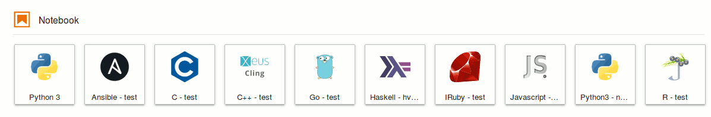

# JupyterWith



This repository provides a Nix-based framework for the definition of
declarative and reproducible Jupyter environments. These environments
include JupyterLab - configurable with extensions - the classic notebook,
and configurable Jupyter kernels.

In practice, a Jupyter environment is defined in a single `shell.nix` file
which can be distributed together with a notebook as a self-contained
reproducible package.

These kernels are currently included by default:

- [IPython](https://github.com/ipython/ipykernel)
- [IHaskell](https://github.com/gibiansky/IHaskell) (long build time)
- [CKernel](https://github.com/brendan-rius/jupyter-c-kernel)
- [IRuby](https://github.com/SciRuby/iruby)
- [Juniper RKernel](https://github.com/JuniperKernel/JuniperKernel) (limited jupyterlab support)
- [IRkernel](https://github.com/IRkernel/IRkernel)
- [Ansible Kernel](https://github.com/ansible/ansible-jupyter-kernel)
- [Xeus-Cling CPP](https://github.com/QuantStack/xeus-cling) (experimental, not yet configurable with packages, long build time)
- [IJavascript](https://github.com/n-riesco/ijavascript) (not yet configurable with packages)
- [gophernotes](https://github.com/gopherdata/gophernotes) (not yet configurable with packages)

Example notebooks are [here](example).

## Getting started

[Nix](https://nixos.org/nix/) must be installed in order to use JupyterWith.
A simple JupyterLab environment with kernels can be defined in a `shell.nix` file such as:

``` nix
let
  jupyter = import (builtins.fetchGit {
    url = https://github.com/tweag/jupyterWith;
    rev = "";
  }) {};

  iPython = jupyter.kernels.iPythonWith {
    name = "python";
    packages = p: with p; [ numpy ];
  };

  iHaskell = jupyter.kernels.iHaskellWith {
    name = "haskell";
    packages = p: with p; [ hvega formatting ];
  };

  jupyterEnvironment =
    jupyter.jupyterlabWith {
      kernels = [ iPython iHaskell ];
    };
in
  jupyterEnvironment.env
```

JupyterLab can then be started by running:

```
nix-shell --command "jupyter lab"
```

This can take a while, especially when it is run for the first time because all
dependencies of JupyterLab have to be downloaded, built and installed. Subsequent
runs are instantaneous for the same environment, or much faster even when some
packages or kernels are changed, since a lot will already be cached.

This process can be largely accelerated by using [cachix](https://cachix.org):

```
cachix use jupyterwith
```

### Using JupyterLab extensions

Lab extensions can be added by generating a JupyterLab frontend directory.
This can be done by running `nix-shell` from the folder with the `shell.nix`
file and then using the `generate-directory` executable that is available from
inside the shell.

``` bash
$ generate-directory [EXTENSIONS]
$ generate-directory jupyterlab-ihaskell jupyterlab_bokeh
```

This will generate a folder called `jupyterlab` that can then be passed to
`jupyterWith`. With extensions, the example above becomes:

``` nix
let
  jupyter = import (builtins.fetchGit {
    url = https://github.com/tweag/jupyterWith;
    rev = "";
  }) {};

  iPython = jupyter.kernels.iPythonWith {
    name = "python";
    packages = p: with p; [ numpy ];
  };

  iHaskell = jupyter.kernels.iHaskellWith {
    name = "haskell";
    packages = p: with p; [ hvega formatting ];
  };

  jupyterEnvironment =
    jupyter.jupyterlabWith {
      kernels = [ iPython iHaskell ];
      ## The generated directory goes here
      directory = ./jupyterlab;
    };
in
  jupyterEnvironment.env
```

#### Impure generator

WARNING: This is not guaranteed to work every time. Read this section
thoroughly before trying.

Another option, which is useful for simple tests, is to use the impure
`mkDirectoryWith` Nix function that comes with this repo:

``` nix
{
  jupyterEnvironment =
    jupyter.jupyterlabWith {
      kernels = [ iPython iHaskell ];
      ## The directory is generated here
      directory = mkDirectoryWith {
        extensions = [
          "jupyterlab-ihaskell"
          "jupyterlab_bokeh"
        ];
      };
    };
}
```

In this case, you must make sure that sandboxing is disabled in your Nix
configuration. Newer Nix versions have it enabled by default. Sandboxing can be
disabled:

- either by running `nix-shell --option sandbox false`; or
- by setting `sandbox = false` in `/etc/nix/nix.conf`.

For this to work, your user must be in the `nix.trustedUsers` list in `configuration.nix`.

### Changes to the default package sets

The kernel environments rely on the default package sets that are provided by
the Nixpkgs repository that is defined in the [nix folder](nix). These package
sets can be modified using overlays, for example to add a new Python package
from PIP. You can see examples of this in the
[`./nix/python-overlay.nix`](nix/python-overlay.nix) and
[`./nix/haskell-overlay.nix`](nix/haskell-overlay.nix) files. You can also modify
the package set directly in the `shell.nix` file, as demonstrated in [this](./example/Haskell/bayesMonad/shell.nix)
example that adds a new Haskell package to the package set.

### Building the Docker images

One can easily generate Docker images from Jupyter environments defined with
JupyterWith with a `docker.nix` file:

``` nix
let
  jupyter = import (builtins.fetchGit {
    url = https://github.com/tweag/jupyterWith;
    rev = "";
  }) {};

  jupyterEnvironment = jupyter.jupyterlabWith {};
in
  jupyter.mkDockerImage {
    name = "jupyter-image";
    jupyterlab = jupyterEnvironment;
  }
```

`nix-build docker.nix` builds the image and it can be passed to Docker with:

```
$ cat result | docker load
$ docker run -v $(pwd)/example:/data -p 8888:8888 jupyter-image:latest
```

## Adding packages to the environment

It is possible to add extra packages to the JupyterWith environment.
For example, if you want to add `pandoc` to the environment in order to convert notebooks to PDF, you can do the following.

``` nix
let
  jupyter = import (builtins.fetchGit {
    url = https://github.com/tweag/jupyterWith;
    rev = "";
  }) {};

  jupyterEnvironment = jupyter.jupyterlabWith {
    extraPackages = p: [p.pandoc];
  };
```

Here, the `p` argument corresponds to Nixpkgs checkout being used. Note that
this can easily be made to use packages from outside `jupyterWith`'s scope, by
providing a function that ignores its argument:

```nix
  extraPackages = _ : [ pkgs.pandoc ];
```

You may also bring all inputs from a package in scope using the
"extraInputsFrom" argument:

``` nix
let
  jupyter = import (builtins.fetchGit {
    url = https://github.com/tweag/jupyterWith;
    rev = "";
  }) {};

  jupyterEnvironment = jupyter.jupyterlabWith {
    extraInputsFrom = p: [p.pythonPackages.numpy];
  };
```

## Adding packages to the Jupyter PATH

Jupyter is ran within its own environment, meaning that packages added with the
method above will not be visible by Jupyter. The `extraJupyterPath` argument
can be used to add extra packages to the scope of Jupyter itself (i.e. not the
kernel). A possible use case of this is to make accessible libraries to the
Python executable that is used by Jupyter itself, which can be necessary when
installing server extensions (see, for example, this
[issue](https://github.com/tweag/jupyterWith/issues/86)).

Using the example in the linked issue, one can add the `jupytext` package to
the Jupyter scope with:

```
let
  jupyter = import (builtins.fetchGit {
    url = https://github.com/tweag/jupyterWith;
    rev = "";
  }) {};

  jupyterEnvironment = jupyter.jupyterlabWith {
    extraJupyterPath = pkgs:
      "${pkgs.python3Packages.jupytext}/lib/python3.7/site-packages";
  };
```

## Using as an overlay

You can import JupyterWith as an overlay as follows:

```
let
  path = import (builtins.fetchGit {
    url = https://github.com/tweag/jupyterWith;
    rev = "";
  }) {};

  overlays = [
    # Only necessary for Haskell kernel
    (import (path ++ /nix/haskell-overlay.nix))
    # Necessary for Jupyter
    (import (path ++ /nix/python-overlay.nix))
    (import (path ++ /nix/overlay.nix))
  ];

  pkgs = import <nixpkgs> { inherit overlays; };
in
  pkgs.jupyterWith;
```

## Contributing

### Kernels

New kernels are easy to add to `jupyterWith`. Kernels are derivations that expose
a `kernel.json` file with all information that is required to run a kernel
to the main Jupyter derivation. Examples can be found in the [kernels](kernels) folder.

### About extensions

In order to install extensions, JupyterLab runs `yarn` to resolve the precise
compatible versions of the JupyterLab core modules, extensions, and all of their
dependencies. This resolution process is difficult
to replicate with Nix. We therefore decided to use the JupyterLab build system
for now to prebuild a custom JupyterLab version with extensions.

If you have ideas on how to make this process more declarative, feel free to
create an issue or PR.

### Nixpkgs

The final goal of this project is to be completely integrated into Nixpkgs
eventually. However, the migration path, in part due to extensions, is not
completely clear.

If you have ideas, feel free to create an issue so that we can discuss.

## License

This project is licensed under the MIT License. See the [LICENSE](LICENSE)
file for details.
